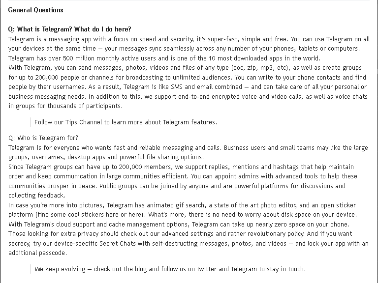
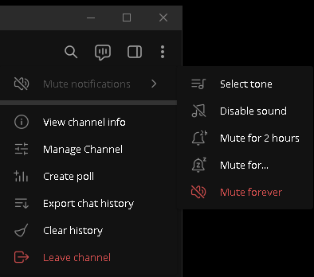
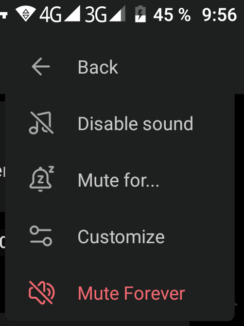
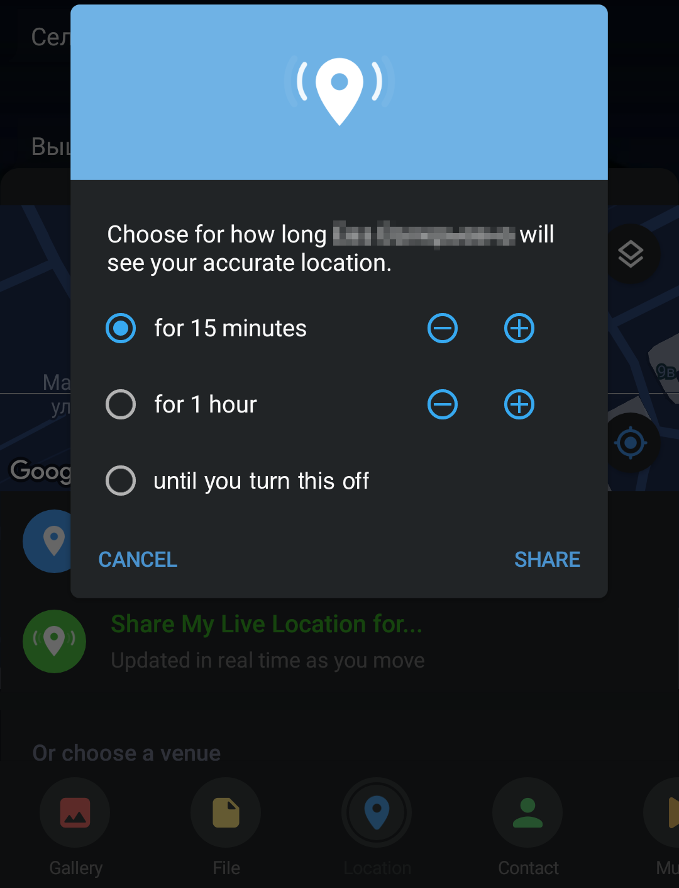
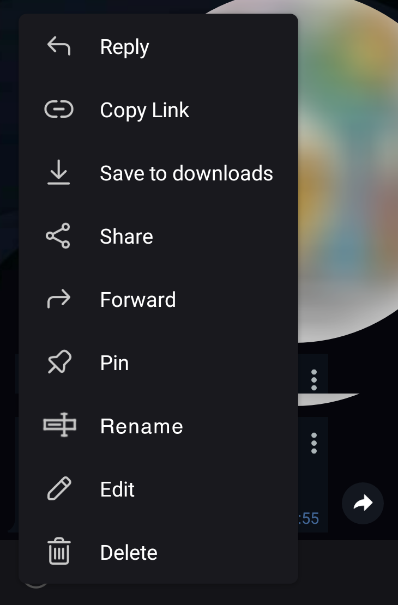
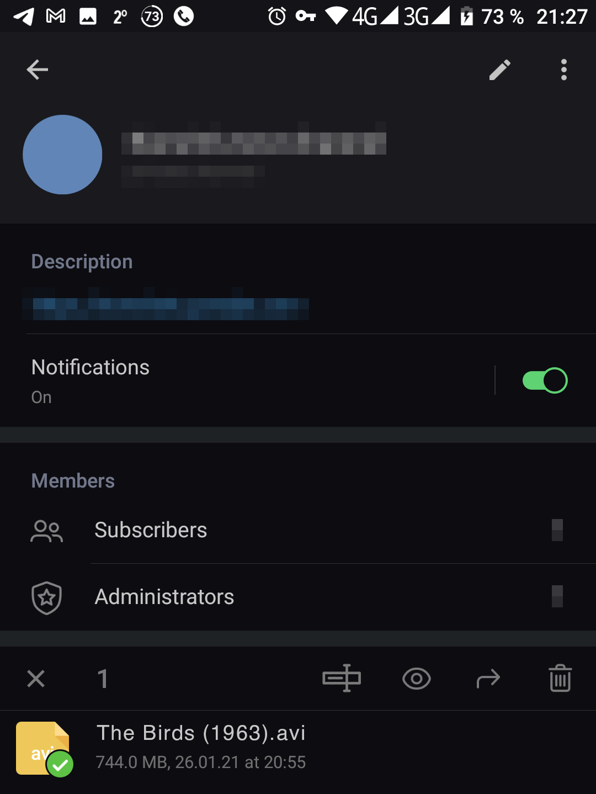
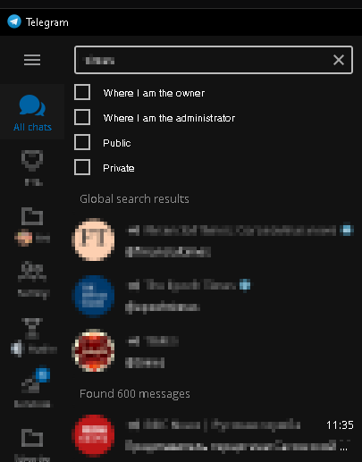

# Andrеy Lаppo — QA Engineer Portfolio

**Manual QA Engineer** | **Documentation Testing** | **Localization QA (Russian)**

Quality Assurance Engineer with 5+ years of continuous testing across enterprise PDF software, mass-market messaging app (Telegram), and 380+ open source projects. **2,500+ issues filed**. Specialized in exploratory testing, usability analysis, and finding edge cases that break real-world workflows.

**LinkedIn**: [Gallem](https://www.linkedin.com/in/gallem/) | **GitHub**: [@Korb](https://github.com/Korb) | **Location**: St Petersburg, Russia (~~Open to relocation: EU, North America, South America~~)

## Table of Contents
- [Testing Expertise](#testing-expertise)
- [Featured Work](#featured-work)
  - [PDF-XChange Pro (Deep Dive)](#pdf-xchange-pro-deep-dive)
  - [Telegram Messenger (Community Impact)](#telegram-messenger-community-impact)
  - [GitHub Open Source (Breadth)](#github-open-source-breadth)
- [Documentation & Localization](#documentation--localization)
- [Open Source Advocacy](#open-source-advocacy)
- [Work in Progress](#work-in-progress)
- [Professional Background](#professional-background)
- [Contact](#contact)

## Testing Expertise

- **Manual QA Testing**: Exploratory testing, regression testing, edge case discovery
- **Documentation Testing**: Technical docs, README files, user-facing text, help systems
- **Localization QA (Russian)**: Interface translation, metadata, encoding issues
- **Usability Analysis**: Workflow friction, UX inconsistencies, terminology review
- **Batch Processing Testing**: Large-scale operations, testing automation tools (not automated testing)
- **Cross-Platform Testing**: Windows, Android, Web, Browser Extensions
- **Edge Case Discovery**: Testing at limits (high zoom, large datasets, legacy formats)
- **Long-term Product Engagement**: Sustained testing over years, deep product knowledge

## Featured Work

### PDF-XChange Pro (Deep Dive)
*4+ years testing enterprise PDF software, Adobe Acrobat's strongest competitor*

**Statistics**:
- **Product**: PDF-XChange Pro (PDF-XChange Editor, PDF-Tools and PDF-XChange Print Drivers)
- **Issues Filed**: 250+ on PDF-XChange forum alone
- **Implemented**: 79 enhancements/fixes
- **Acceptance rate**: 69%
- **Issue Types**: 56 Enhancements, 59 UX/Usability, 33 Functionality bugs
- **Duration**: 4+ years continuous engagement
- **Skills**: Exploratory testing, usability analysis, batch processing, edge cases, workflow design, persistence on hard-to-reproduce bugs

#### Top 10 Implemented Improvements

[See detailed case studies](pdf-xchange)

#### Brief Highlights

1. **[Critical Search Hang](https://forum.pdf-xchange.com/viewtopic.php?t=43104)**: Multi-file search freezing for hours → Fixed after investigation
   - *Impact*: Blocked entire workflow, hours lost
   - *Skills*: Hard-to-reproduce bugs, persistence with developers

2. **[Auto-Remove Hyphenations](https://forum.pdf-xchange.com/viewtopic.php?t=41728)**: Export books to text without manual cleanup
   - *Impact*: Saved hours per 100+ page book
   - *Skills*: Workflow testing, real-world use cases

3. **["Crawling" Selection Bug](https://forum.pdf-xchange.com/viewtopic.php?t=38082)**: Crop tool drifted at high zoom
   - *Impact*: Precision work impossible at 400%+ zoom
   - *Skills*: Pixel-level precision, edge conditions, week-long investigation

4. **[Split Lines Beyond Page Edges](https://forum.pdf-xchange.com/viewtopic.php?p=178885)**: Visual improvement for page split guides
   - *Impact*: Much more visible, matches Adobe behavior
   - *Skills*: Comparative analysis, visual testing

5. **[Broken Filename Macros](https://forum.pdf-xchange.com/viewtopic.php?t=46421)**: Batch processing overwrote files
   - *Impact*: Data loss risk in batch operations
   - *Skills*: Batch workflow testing, macro systems

6. **[PDF-Tools Context Menu](https://forum.pdf-xchange.com/viewtopic.php?t=39276)**: Proposed unified Windows Explorer integration
   - *Impact*: Transformed batch processing UX (3-year implementation)
   - *Skills*: Product vision, feature specification

7. **[Progress Bar for Search](https://forum.pdf-xchange.com/viewtopic.php?t=39744)**: Added ETA display for long operations
   - *Impact*: Users can now plan, know if frozen
   - *Skills*: Long-running operations, user psychology

8. **[Batch Export Bug](https://forum.pdf-xchange.com/viewtopic.php?t=42096)**: Fixed mixed encoding in legacy MS Word files
   - *Impact*: Blocked batch processing of old archives
   - *Skills*: Legacy format handling, encoding issues

9. **[Remove OCR Languages](https://forum.pdf-xchange.com/viewtopic.php?t=37493)**: Added uninstall for language packs
   - *Impact*: Disk space management, user control
   - *Skills*: Installation testing, missing features

10. **[Sync OCR Settings](https://forum.pdf-xchange.com/viewtopic.php?t=37968)**: Eliminated repeated language configuration
    - *Impact*: Workflow efficiency, consistency
    - *Skills*: Cross-feature testing, user expectations

#### Skills Demonstrated
- Long-term product engagement (4+ years)
- Batch processing & workflow testing
- Legacy format handling, encoding issues
- Persistence on hard-to-reproduce bugs
- Real-world large-scale testing (1000+ file collections)
- Feature design thinking

<table><td>
<a href="#table-of-contents">↥ Scroll to ToC</a>
</td></table>

### Telegram Messenger (Community Impact)
*5+ years, mass-market messaging app (400M+ users)*

**Platform**: [bugs.telegram.org](https://bugs.telegram.org) — community suggestion platform with voting system

**Statistics**:
- **Total Issues**: 308
- **Project**:
  - Cross-platform: 84
  - Telegram Desktop: 124
  - Telegram for Android: 100
- **Issue Types**:
  - Enhancement: 143 (47%)
  - UX & Usability: 100 (32%)
  - Layout & Design: 23
  - Functionality: 26
  - Others: 16 (Accessibility, Security, Performance, etc.)
- **Implemented**: 11 features/fixes[^1]
- **Community Validation**: Multiple suggestions with up to 90 user votes

[^1]: the bugs.telegram.org platform is not always maintained up-to-date by developers. Many implemented features remain marked as "open" in the system. The 11 officially confirmed implementations listed above were verified through actual feature releases.

#### Implemented Improvements

**1. Text Formatting as Quote** ([#1361](https://bugs.telegram.org/c/1361))
- **Type**: Enhancement
- **Impact**: Added fundamental text formatting option used daily by millions
- **Use Case**: Replying to specific parts of messages in discussions

Click to see screenshot from issue explanation

**2. Allow Quotes to be Collapsed** ([#48496](https://bugs.telegram.org/c/48496))
- **Type**: Enhancement  
- **Impact**: Improved readability of long posts with multiple quotes
- **Demonstrates**: Thinking about further improving the previous function for special cases

**3. HEVC Video Upload Support** ([#29058](https://bugs.telegram.org/c/29058))
- **Type**: Functionality
- **Impact**: Modern codec support, smaller file sizes for same quality
- **Technical**: Cross-platform codec compatibility

**4. Archived Chats Search Visibility** ([#17178](https://bugs.telegram.org/c/17178))
- **Type**: Functionality Bug
- **Impact**: Archived chats were invisible in search, breaking user expectations
- **Demonstrates**: Finding non-obvious workflow issues

**5. Video Size Limit Notifications** ([#48453](https://bugs.telegram.org/c/48453))
- **Type**: Error Handling
- **Impact**: Users no longer waste time uploading videos that will be rejected
- **UX**: Proactive error prevention vs reactive error messages

**6 and 7. UI Labels: "Mute" → "Notifications"** ([#19393](https://bugs.telegram.org/c/19393), [#19394](https://bugs.telegram.org/c/19394))
- **Type**: UX & Usability (2 related issues)
- **Impact**: Clearer terminology — "Mute" is a special case, unlike "Notifications" — a general category that increments all actions combined in a submenu, including "Mute"
- **Demonstrates**: Microcopy/terminology thinking

Click to see screenshots

͏

**8. Real-time Location Sharing Until Disabled** ([#2154](https://bugs.telegram.org/c/2154))
- **Type**: Enhancement
- **Impact**: Currently, location sharing expires after maximum 8 hours, forcing manual renewal. This creates gaps in coverage and unreliable tracking for safety-critical or extended-duration scenarios. An "until turned off" option would provide seamless, continuous sharing aligned with user expectations from similar platforms.
- **Use Case**: Search and rescue coordination, parental monitoring, family/close contacts awareness, extended outdoor activities, and elderly care

Click to see screenshot

**9. Return to Original Message After Forwarding** ([#17491](https://bugs.telegram.org/c/17491))
- **Type**: UX & Usability
- **Impact**: Eliminated disorientation after forwarding—automatically returns to context
- **Workflow**: Common action (forward) → smooth continuation

**10. "Play Cached Music Only" Mode** ([#2305](https://bugs.telegram.org/c/2305))
- **Type**: Enhancement
- **Impact**: Data-saving mode for users with limited mobile data
- **Demonstrates**: Understanding diverse user contexts (data constraints)

**11. "Stop and Block Bot" in Search Results** ([#3239](https://bugs.telegram.org/c/3239))
- **Type**: UX & Usability
- **Impact**: Simplified bot management—action available directly from search
- **Workflow**: Reduced steps for cleaning task

#### Top-10 by Community Votes
*These suggestions received up to 90 votes, demonstrating understanding of widely-felt pain points*

**1. Drag & Drop Chats to Folders** ([#1208](https://bugs.telegram.org/c/1208)) — **90+ votes**
- Intuitive organization method matching user expectations from file managers
- Currently: manual folder assignment through main Settings menus

**2. "Schedule Message" in Share Menu** ([#2717](https://bugs.telegram.org/c/2717)) — **40+ votes**
- Extend scheduling feature to external shares, not just in-app messages
- Use case: Share from browser → schedule for later

**3. Send Videos as Videos, Not Documents** ([#2192](https://bugs.telegram.org/c/2192)) — **30+ votes**
- Fix: Videos from certain sources default to "document" format
- Impact: Proper playback preview instead of download-only (and then switching to another app to watch the video)

**4. Opt-out of Link Previews** ([#3195](https://bugs.telegram.org/c/3195)) — **30+ votes**
- User control: Disable automatic link preview fetching
- Privacy: Prevent revealing visited sites to link preview servers

**5. Rename Uploaded Files** ([#1176](https://bugs.telegram.org/c/1176)) — **30+ votes**
- Edit filenames before/after upload
- Use cases: Generic camera filenames → descriptive names; fixing names corrupted by Telegram's upload manager ([#1209](https://bugs.telegram.org/c/1209))

Click to see screenshots

͏

**6. Add Media to Previously Sent Messages** ([#2750](https://bugs.telegram.org/c/2750)) — **20+ votes**
- Edit message to include image/video after sending
- Matches modern messaging expectations

**7. EXIF Data Control When Sending Photos** ([#1411](https://bugs.telegram.org/c/1411)) — **20+ votes**
- Privacy: Choose to strip or keep location/camera metadata
- Use case: Share photos without revealing location

**8. Text Notes for Groups/Channels/Bots** ([#2835](https://bugs.telegram.org/c/2835)) — **20+ votes**
- Personal notes attached to any chat (visible only to you)
- Use case: Context about why you joined, project details, etc.

**9. Global Search Filters** ([#2916](https://bugs.telegram.org/c/2916)) — **20+ votes**
- Filter by: "Where I'm owner/admin", "Public/Private"
- Power user feature for managing many groups/channels

Click to see screenshot

hr />

**10. Show Folders Containing Each Chat** ([#1114](https://bugs.telegram.org/c/1114)) — **15+ votes**
- Display which folder(s) include current chat in chat properties
- Organization: Know where chat lives in your folder structure

Click to see screenshot

#### Skills Demonstrated

**Mass-Market App Testing**:
- Consumer-facing features (400M+ users)
- Cross-platform thinking (Desktop, Android, iOS considerations)
- Diverse user contexts (data limits, privacy needs, power users)

**Community Engagement**:
- Voting system participation (identifying widely-felt issues)
- Understanding pain points that resonate with thousands of users
- Feature requests that receive 50-100+ community votes

**UX & Enhancement Focus**:
- 47% Enhancement suggestions (improving existing features)
- 32% UX/Usability improvements (workflow optimization)
- Terminology/microcopy thinking (renaming "Mute" to "Notifications")

**Workflow Analysis**:
- Identifying multi-step processes that could be streamlined
- Error prevention (video size limits) vs error handling
- Context preservation (return to message after forwarding)

**Platform Understanding**:
- bugs.telegram.org is a community suggestion platform, not a traditional bug tracker
- Acceptance rate (~3-4%) is typical for mass-market apps with high suggestion volume
- Many suggestions remain "open" even when implemented—platform maintenance limitation

<table><td>
<a href="#table-of-contents">↥ Scroll to ToC</a>
</td></table>

### GitHub Open Source (Breadth)
*5+ years. Demonstrating breadth: testing across 380+ repositories in last 2 years*

**Statistics**:
- **2025**: 900 contributions (368 repos) — 75% Issues, 9% PRs, 15% Commits, 1% Code review
- **2024**: 578 contributions (305 repos)
- **2023**: 169 contributions (113 repos)
- **Total**: 1,191 contributions across diverse projects

#### Top 8 Issues Across Diverse Projects

[See detailed case studies](github)

#### Summary Statistics
- **Total GitHub Contributions**: 1,191 (380 repos in 2024-2025 alone)
- **Types**: Crash bugs, UI/UX issues, localization, documentation, compatibility
- **Platforms**: Desktop (Windows), Mobile (Android), Web, Browser Extensions
- **Skills**: Exploratory testing, cross-platform, i18n, accessibility, real-world scenarios
- **Approach**: Systematic testing, diverse test data, field testing, edge case discovery

**Brief Highlights**:

1. **[Spectral Emulator: AVX2 Incompatibility](https://github.com/r-lyeh/Spectral/issues/4)** (Critical crash)
   - Entire CPU generations excluded (pre-2013 Intel/AMD)
   - *Skills*: Hardware compatibility, CPU instruction sets

2. **[RetroArch: ISO Crash](https://github.com/libretro/RetroArch/issues/16906)** (Critical)
   - Crash on ISOs without serial numbers (homebrew discs)
   - *Skills*: Edge case file formats, homebrew testing

3. **[HomeMedkit: Data Loss Prevention](https://github.com/pewaru-333/HomeMedkit-App/issues/60)** (High severity)
   - Users losing medication data silently
   - *Skills*: Workflow analysis, form validation UX

4. **[DocsAfterDark: Dark Theme Bugs](https://github.com/waymondrang/docsafterdark/issues?q=is%3Aissue%20author%3Akorb%20state%3Aclosed)** (6 visual bugs)
   - Invisible checkmarks, unreadable text, cursor issues
   - *Skills*: Systematic UI testing, accessibility/contrast

5. **[Locus: Location Features](https://github.com/Myzel394/locus/issues?q=is%3Aissue%20author%3Akorb%20state%3Aclosed)** (many feature requests, all implemented)
   - Real SAR scenarios: own track display, compass, offline buffering
   - *Skills*: Field testing, safety-critical apps

6. **[Unison: UTF-8 Bug](https://github.com/bcpierce00/unison/issues/959)** (Encoding bug)
   - Filename corruption for national characters
   - *Skills*: i18n testing, cross-platform encoding

7. **[StreetComplete: Location Arrow](https://github.com/streetcomplete/StreetComplete/issues/6562)** (Visual bug)
   - Invisible direction arrow in dark theme
   - *Skills*: Field testing, OSM (OpenStreetMap) contribution

8. **[FacilMap: Browser Setting Conflict](https://github.com/FacilMap/facilmap/issues/312)** (Compatibility)
   - Broken rendering due to obscure browser accessibility setting
   - *Skills*: Troubleshooting environmental issues, browser diversity

**Skills Demonstrated**:
- Exploratory testing across diverse projects
- Cross-platform (Desktop, Mobile, Web, Extensions)
- Various domains (emulators, maps, productivity, healthcare)
- Real-world scenarios (SAR, field mapping)
- Internationalization (encoding, UTF-8)

<table><td>
<a href="#table-of-contents">↥ Scroll to ToC</a>
</td></table>

## Documentation & Localization

**Translation Work** (70+ apps):
- **Scope**: Full applications (mobile, desktop, device firmware), app metadata (F-Droid/IzzyOnDroid), UI strings, changelogs, feature descriptions, help documentation
- **Platforms**: Weblate, Crowdin, GitHub
- **Languages**: Russian, English
- **Examples**:
  - The [Healthy Battery Charging](https://github.com/vbresan/HealthyBatteryCharging) app has been fully translated into Russian.
  - The translation of the [SCEE](https://github.com/Helium314/SCEE) application into Russian has been completed (131 of 648 strings)
  - The translation of the [MediTrak](https://github.com/AdamGuidarini/MediTrak) app into Russian has been completed (85 of 222 strings)
  - [Obtainium PR](https://github.com/ImranR98/Obtainium/pull/2628) with formatting improvements

**README Improvements** (100+):
- Added screenshots: 15+ projects
- Fixed dark theme logos: 5+ projects
- Corrected app naming inconsistencies: 10+ projects
- Added missing documentation sections (uninstall instructions, language support)

## Open Source Advocacy

**F-Droid/IzzyOnDroid Ecosystem**:
- 200+ contributions
- Encouraged 70+ developers to add screenshots
- Advocated for Per-App Language Selector in 15+ apps
- Helped 7+ developers publish to F-Droid
- Added and fixed Fastlane metadata structures, including platform-specific requirements
- Identified and documented F-Droid/IzzyOnDroid differences for developers

## Work in Progress

*100+ PDF-XChange issues currently under review—showing most notable pending cases.
Hundreds of issues on GitHub, GitLab, and Codeberg waiting for their turn.*

### Confirmed Bugs Awaiting Fix
1. **[Replace All Bug](https://forum.pdf-xchange.com/viewtopic.php?t=48533)**: First search result deleted — confirmed for next release
2. **[Two Pages Mode Selection](https://forum.pdf-xchange.com/viewtopic.php?t=48541)**: Cannot select images across pages — investigating reproducibility
3. **[OEM-855 Encoding](https://forum.pdf-xchange.com/viewtopic.php?t=48520)**: Legacy encoding not recognized — in queue

### Accessibility Issues Under Investigation
4. **[Dialog Focus](https://forum.pdf-xchange.com/viewtopic.php?t=48547)**: Save dialog appears without focus (keyboard navigation broken)
5. **[Context Menu Focus](https://forum.pdf-xchange.com/viewtopic.php?t=45231)**: Menu appears but items not keyboard-accessible

## Professional Background

### Content Manager (2021-2024)
*Medical equipment e-commerce platform*

**Key Achievements**:
- Created documentation management system for **50,000+ products** from 1,200+ manufacturers
- Processed **100,000+ documents**: digitization, OCR, metadata, deduplication
- Developed PDF protection mechanism saving **$15,000 annually**
- Established workflow for translators/editors, improving efficiency **40%**, reducing delays **65%**
- Set up automated competitor price parsing
- Created wiki with 60+ articles
- Proofread, edited, and made layouts for 553 articles in [corporate blog](https://stomdevice.ru/blog-dlya-stomatologov/)
- Standardized 10 years of inconsistent content, improving readability and professionalism

**Skills**: Technical documentation, content management, batch processing testing, workflow design

### Search & Rescue Service (2011-2019)
*Municipal lifeguard, 8+ years*

**Certifications**: Professional Diver (Grade 5), Industrial Climber, First Aid, Wilderness First Responder  
**Field Experience**: 15+ SAR operations, 65+ public event safety duties  
**Recognition**: 6 commendations, 4 diplomas, medal from Russian Emergencies Ministry

*Relevant to QA: Real-world testing under pressure, attention to detail in life-safety scenarios, field testing experience*

### Technical Proofreader (2009-2011)
*Technical documentation for military equipment*

- Proofread 800+ standard pages monthly of Russian-English-Spanish technical documentation
- Worked with SDL Trados translation memory system
- Specialized in military equipment manuals (security clearance required)

*Note: Portfolio samples unavailable due to confidentiality*

**Skills**: Technical proofreading, translation QA, SDL Trados

## Technical Skills

**Operating Systems**:
- Windows (advanced)
- Android
**Tools**:
- Excel/Google Sheets (advanced formulas)
- Git/GitHub
- SDL Trados
- OCR software
**Testing Types**: Exploratory, usability, regression, localization, accessibility, cross-platform, batch processing  
**Documentation**: Technical writing, README creation, user guides, translation  
**Languages**: HTML, Markdown, BBCode
**Domains**: PDF workflows, batch processing, file formats, encoding/UTF-8, maps/GIS, messaging apps

## Contact

**Open to**:
- Remote QA Engineer positions (worldwide)
- On-site positions in EU, North America, South America
- Contract / Part-time / Full-time

**Preferred Roles**:
- Manual QA Engineer / QA Tester / Quality Assurance Analyst
- Documentation Testing Specialist
- Localization QA Specialist (Russian)
- Technical Writer with QA focus

**Links**:
- **Professional**
  - LinkedIn: [Andreу Laрpo](https://www.linkedin.com/in/gallem/)
  - GitHub: [@Korb](https://github.com/Korb)
- **Additional Repositories**
  - GitLab: [@Nia_Ward](https://gitlab.com/Nia_Ward)
  - Codeberg: [@Otto_Ball](https://codeberg.org/Otto_Ball)
- **Translation Profiles**:
  - Weblate: [Lowri_Olsen](https://hosted.weblate.org/user/Lowri_Olsen/)  
  - Crowdin: @Niyah_Atkins  
  
**Email**: available on LinkedIn

*This portfolio demonstrates 4+ years of professional-grade QA work through consistent, high-quality contributions to enterprise software, mass-market applications, and open source projects.*

<table><td>
<a href="#andrey-lappo--qa-engineer-portfolio">↥ Scroll to Top</a>
</td></table>

