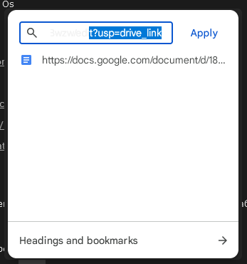
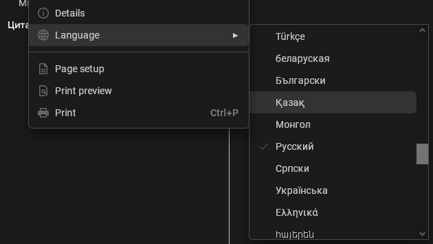
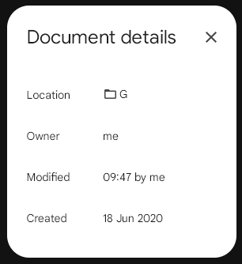
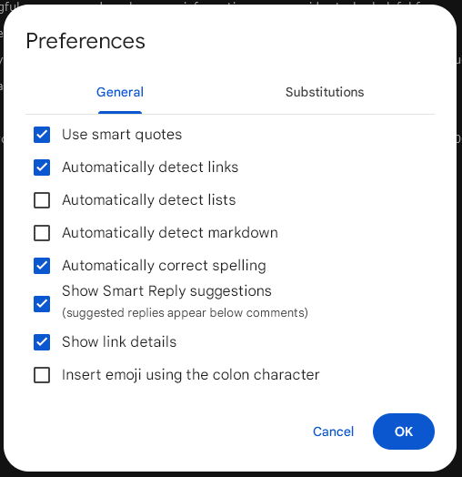
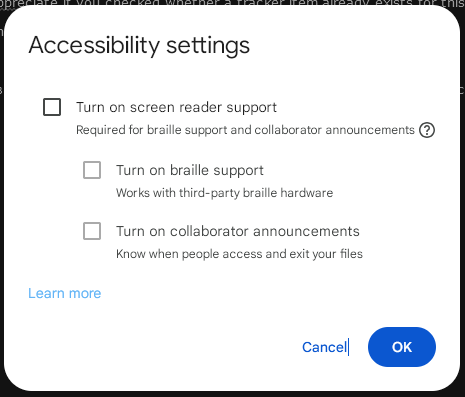
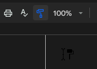
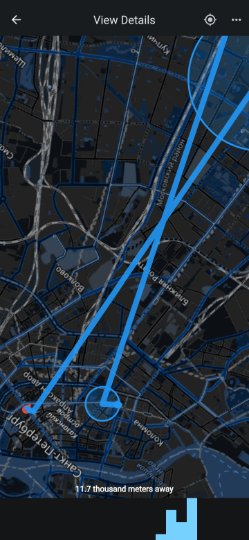
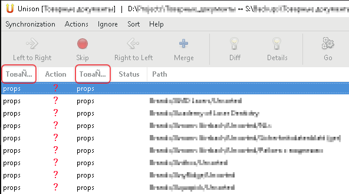
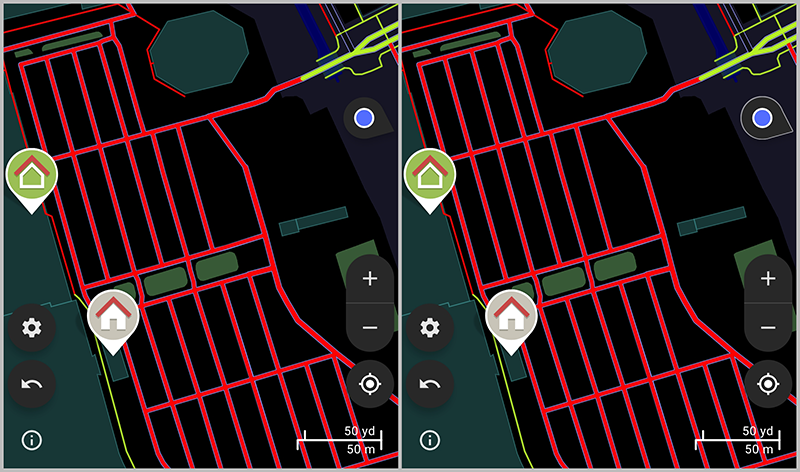
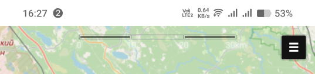

[Andrey Lаpрo — QA Engineer Portfolio](README.md) / [Featured Work](README.md#featured-work) / [GitHub Open Source (2023-2025)](README.md#github-open-source-breadth)

# Top 8 Issues Across Diverse Projects

## Table of Contents
- [1. Critical: CPU Compatibility Issue in Spectral](#1-critical-cpu-compatibility-issue-in-spectral)
- [2. Critical: Crash in RetroArch with Malformed ISOs](#2-critical-crash-in-retroarch-with-malformed-isos)
- [3. Data Loss Prevention in HomeMedkit](#3-data-loss-prevention-in-homemedkit)
- [4. Dark Theme Bugs in Google Docs Extension](#4-dark-theme-bugs-in-google-docs-extension)
- [5. Location Tracking Features in Locus](#5-location-tracking-features-in-locus)
- [6. UTF-8 Bug in Unison File Synchronizer](#6-utf-8-bug-in-unison-file-synchronizer)
- [7. Location Arrow Invisible in StreetComplete Dark Theme](#7-location-arrow-invisible-in-streetcomplete-dark-theme)
- [8. Browser Setting Conflict in FacilMap](#8-browser-setting-conflict-in-facilmap)

*Demonstrating breadth: exploratory testing across 380+ repositories in 2 years*

## 1. Critical: CPU Compatibility Issue in Spectral

**Project/Link**: [Spectral](https://github.com/r-lyeh/Spectral) (Sinclair ZX Spectrum retro-computer emulator) / [#4 — AVX2 incompatibility](https://github.com/r-lyeh/Spectral/issues/4)

**Type**: Compatibility, Crash Bug

**Status**: Fixed

**Problem**: Application crashed on launch for all non-AVX2 CPUs (Intel pre-Haswell, AMD pre-Excavator, affecting millions of older systems).

**How I Found It**: Downloaded new emulator release, immediate crash on my test system. Researched CPU instruction sets, identified AVX2 as likely culprit.

**Impact**: 

- **Severity**: Critical — complete inability to run on entire CPU generations
- **User Base**: Excluded users with CPUs older than 2013-2014
- **Platform**: Windows desktop application

**Skills Demonstrated**: 

- Hardware compatibility testing
- CPU instruction set knowledge
- Root cause analysis from crash behavior
- Clear technical reporting

**Resolution**: Developer confirmed, rebuilt without AVX2 requirement.

## 2. Critical: Crash in RetroArch with Malformed ISOs

**Project/Link**: [RetroArch](https://github.com/libretro/RetroArch) (multi-platform emulator) / [#16906 - Crash reading ISOs without serial](https://github.com/libretro/RetroArch/issues/16906)

**Type**: Crash Bug

**Status**: Fixed

**Problem**: Application crashed when attempting to read ISO files missing embedded serial numbers (common in homebrew/demo discs).

**How I Found It**: Testing RetroArch with diverse ISO collection including homebrew games, observed consistent crashes on specific files.

**Impact**:

- **Severity**: High — application crash
- **Data Safety**: Potential loss of unsaved progress
- **Use Case**: Blocked homebrew/demo scene users

**Skills Demonstrated**: 

- Edge case file format testing
- Crash reproduction with specific test cases
- Understanding disc image metadata
- Test file curation (homebrew ISOs)

**Resolution**: Fixed in next release.

## 3. Data Loss Prevention in HomeMedkit

**Project/Link**: [HomeMedkit](https://github.com/pewaru-333/HomeMedkit-App) (medication tracking app) / [#60](https://github.com/pewaru-333/HomeMedkit-App/issues/60) & [#61](https://github.com/pewaru-333/HomeMedkit-App/issues/61)

**Type**: UX / Data Loss Bug

**Status**: Fixed

**Problem**: Users could lose entered medication data if they didn't realize form validation requirements before navigating away. No save prompt, no warning.

**How I Found It**: Workflow testing—filling forms, testing navigation patterns. Realized data silently discarded.

**Impact**: 

- **Severity**: High — silent data loss
- **User Frustration**: Re-entering same medication repeatedly
- **Trust**: Users questioning if app is saving anything

**Skills Demonstrated**: 

- User workflow analysis
- Data loss scenario identification
- Form validation UX testing
- Critical thinking: "what if user doesn't notice X?"

**Resolution**: Added save confirmation prompt and clearer validation feedback.

## 4. Dark Theme Bugs in Google Docs Extension

**Project/Link**: [DocsAfterDark](https://github.com/waymondrang/docsafterdark) (dark theme for Google Docs) / [#56](https://github.com/waymondrang/docsafterdark/issues/56), [#57](https://github.com/waymondrang/docsafterdark/issues/57), [#58-60](https://github.com/waymondrang/docsafterdark/issues/58), [#61](https://github.com/waymondrang/docsafterdark/issues/61)  

**Type**: Visual / Accessibility Bugs

**Status**: All Fixed

**Problem**: 

- Light text on light background (unreadable)
- Checkmarks invisible in dark theme
- Cursor barely visible in certain tools
- Multiple dialogs not inverted correctly

**Evidence**: 

Click to see screenshots

  
  
  
  
  
  
  

͏  
**How I Found It**: Comprehensive testing of all Google Docs features with extension enabled, methodically checking every dialog, menu, and tool.

**Impact**:

- **Accessibility**: Features unusable in dark mode
- **Contrast**: Failed WCAG guidelines
- **User Experience**: Forced users to disable extension temporarily

**Skills Demonstrated**: 

- Systematic UI testing (every dialog, every menu)
- Accessibility/contrast awareness
- Visual regression testing
- Screenshot documentation for visual bugs
- Browser extension testing

**Resolution**: All reported issues fixed with CSS adjustments.

## 5. Location Tracking Features in Locus

**Project/Link**: [Locus](https://github.com/Myzel394/locus) (location sharing app) / [#103](https://github.com/Myzel394/locus/issues/103), [#108](https://github.com/Myzel394/locus/issues/108), [#109](https://github.com/Myzel394/locus/issues/109)

**Type**: Feature Requests

**Status**: All Implemented

**Problem**: 

- App showed others' tracks but not your own (disorienting during forest searches)
- No compass after rotating map (lost orientation)
- No offline history buffering (data lost without connectivity)

**Evidence**: 

Click to see screenshot

͏  
**How I Found It**: Real-world testing during search & rescue scenarios. Identified critical gaps for wilderness use.

**Impact**: 

- **Use Case**: Made app practical for SAR/hiking
- **Safety**: Better orientation in wilderness
- **Data Reliability**: No location data lost offline

**Skills Demonstrated**: 

- Real-world scenario testing (search & rescue)
- Mobile app testing in field conditions
- Offline functionality testing
- Feature gap identification for specific use cases
- Understanding user needs in critical scenarios

**Resolution**: All three features implemented.

## 6. UTF-8 Bug in Unison File Synchronizer

**Project/Link**: [Unison](https://github.com/bcpierce00/unison) (cross-platform file sync) / [#959 — Incorrect UTF-8 handling](https://github.com/bcpierce00/unison/issues/959)

**Type**: Encoding / Localization Bug

**Status**: Fixed

**Problem**: File sync failed or corrupted filenames containing non-ASCII characters (Cyrillic, Asian scripts, etc.) due to UTF-8 encoding mishandling.

**Evidence**: 

Click to see screenshot

͏  
**How I Found It**: Testing file synchronization with Russian filenames, observed corruption and sync failures.

**Impact**: 

- **Internationalization**: Broke sync for non-English users
- **Data Integrity**: Filename corruption risk
- **Cross-platform**: Especially problematic Windows ↔ Linux

**Skills Demonstrated**: 

- Internationalization (i18n) testing
- Character encoding knowledge
- Cross-platform testing (Windows/Linux)
- Test data with diverse character sets
- Localization awareness (Cyrillic)

**Resolution**: Encoding logic corrected.

## 7. Location Arrow Invisible in StreetComplete Dark Theme

**Project/Link**: [StreetComplete](https://github.com/streetcomplete/StreetComplete) (OpenStreetMap editing app) / [#6562 — Location arrow barely visible](https://github.com/streetcomplete/StreetComplete/issues/6562)

**Type**: Visual / Dark Theme Bug  

**Status**: Fixed

**Problem**: User's location direction arrow on map was nearly invisible on dark background (black arrow on dark map).

**Evidence**: 

Click to see screenshot

͏  
**How I Found It**: Field testing with dark theme enabled, couldn't tell which direction I was facing while walking.

**Impact**: 

- **Navigation**: Critical for wayfinding app
- **Dark Theme**: Broke primary feature in dark mode
- **Accessibility**: Contrast issue

**Skills Demonstrated**: 

- Mobile app testing
- Dark theme testing
- Field testing (real-world use)
- Accessibility/contrast awareness
- Map UI testing

**Resolution**: Arrow color changed to high-contrast white/yellow.

## 8. Browser Setting Conflict in FacilMap

**Project/Link**: [FacilMap](https://github.com/FacilMap/facilmap) (collaborative web maps) / [#312 — Unexpected rendering due to browser setting](https://github.com/FacilMap/facilmap/issues/312)

**Type**: Compatibility / Edge Case

**Status**: Fixed

**Problem**: Added map elements appeared broken due to my browser's "dark mode override" setting that developer wasn't aware existed.

**Evidence**: 

Click to see screenshot

͏  
**How I Found It**: Added map marker, looked completely wrong. Methodically disabled browser settings until found culprit.

**Impact**: 

- **User Confusion**: "Is the app broken?"
- **Developer Blind Spot**: Uncovered browser setting affecting rendering
- **Compatibility**: Affected users with accessibility settings enabled

**Skills Demonstrated**: 

- Systematic debugging (isolate variables)
- Browser setting awareness
- Understanding user environment diversity
- Cross-browser/setting compatibility testing
- Clear communication of non-obvious issue

**Resolution**: Developer added handling for this browser setting.

<table><td>
<a href="#top-8-issues-across-diverse-projects">↥ Scroll to top</a>
</td></table>

