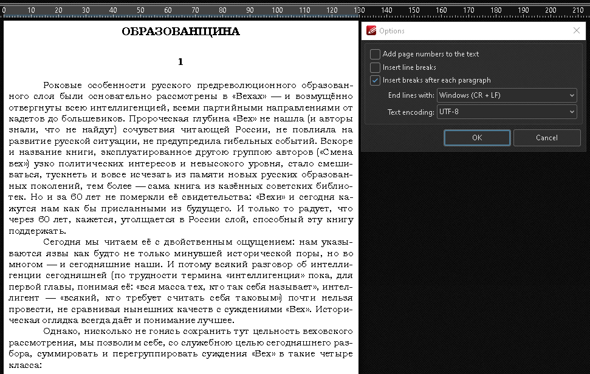
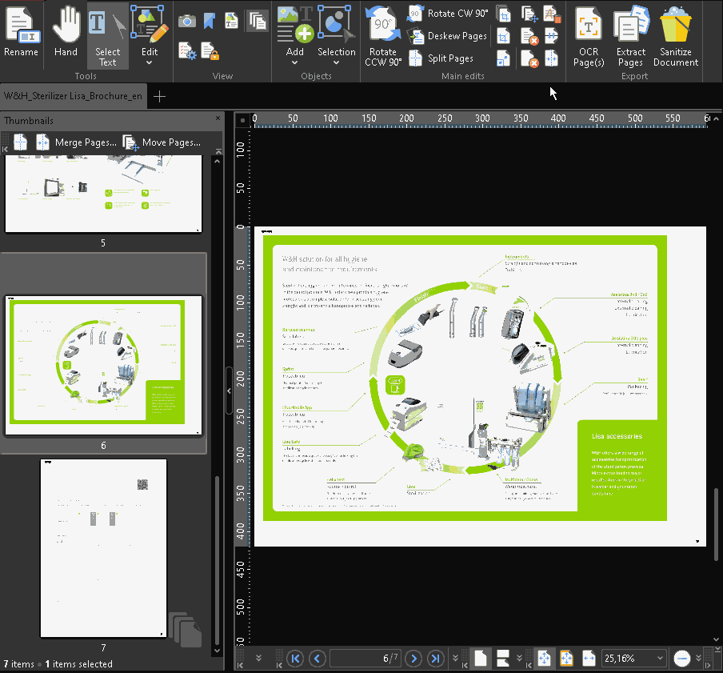
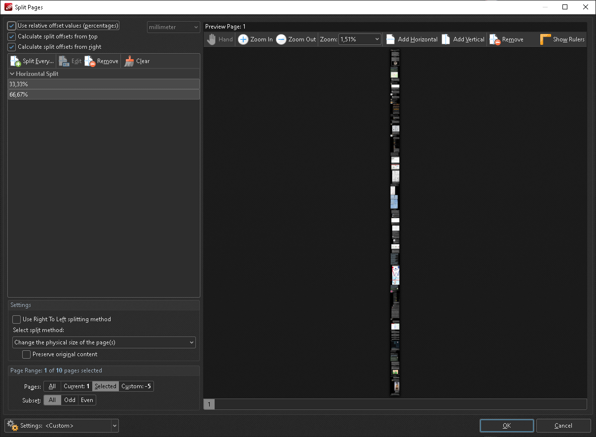
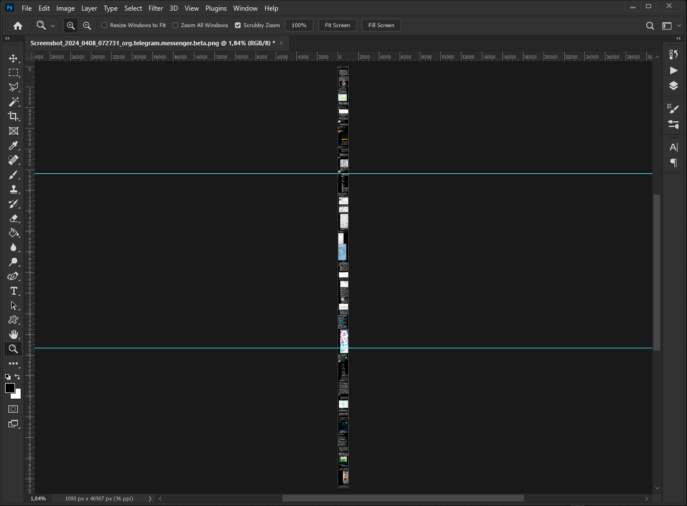
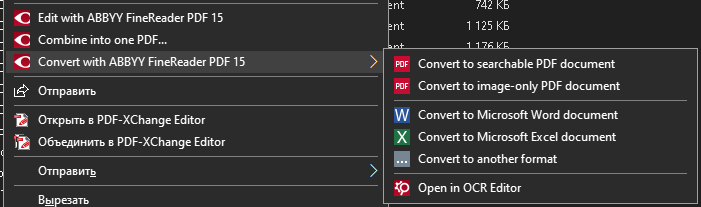
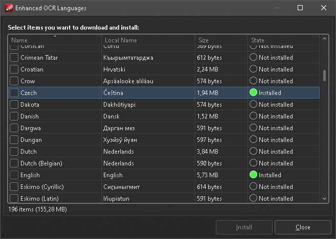
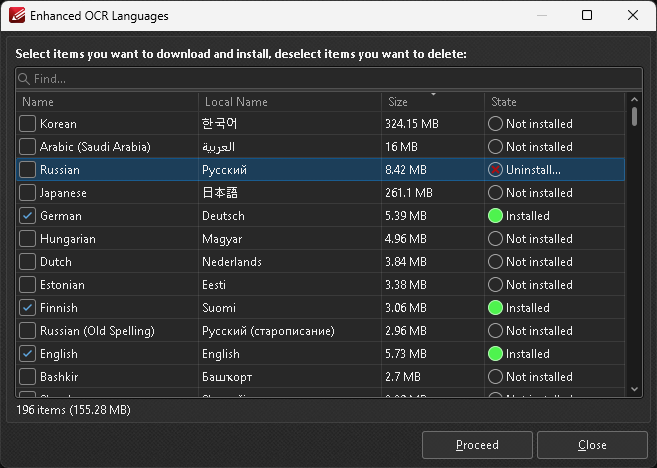

[Andrеy Lapрo — QA Engineer Portfolio](https://korb.github.io/qa-portfolio) / [Featured Work](https://korb.github.io/qa-portfolio#featured-work) / [PDF-XChange Pro (Deep Dive)](https://korb.github.io/qa-portfolio#pdf-xchange-pro-deep-dive)

# Top 10 Implemented Improvements

## Table of Contents
- [1. Critical: Search Process Hangs for Hours](#1-critical-search-process-hangs-for-hours)
- [2. Major Efficiency: Auto-Remove Hyphenations on Export](#2-major-efficiency-auto-remove-hyphenations-on-export)
- [3. Complex: “Crawling” Selection Area Bug](#3-complex-crawling-selection-area-bug)
- [4. Visual Improvement: Split Lines Beyond Page Edges](#4-visual-improvement-split-lines-beyond-page-edges)
- [5. Functionality: Broken Filename Macro in Batch Processing](#5-functionality-broken-filename-macro-in-batch-processing)
- [6. Feature Request: Context Menu Integration for PDF-Tools](#6-feature-request-context-menu-integration-for-pdf-tools)
- [7. UX: Progress Bar for Long-Running Search](#7-ux-progress-bar-for-long-running-search)
- [8. Batch Processing: Export to Word Bug with Mixed Files](#8-batch-processing-export-to-word-bug-with-mixed-files)
- [9. Feature: Remove Installed OCR Languages](#9-feature-remove-installed-ocr-languages)
- [10. Consistency: Sync OCR Language Selection Between Tools](#10-consistency-sync-ocr-language-selection-between-tools)

## 1. Critical: Search Process Hangs for Hours
**Project/Link**: PDF-XChange Editor / [Searching among documents hangs](https://forum.pdf-xchange.com/viewtopic.php?t=43104)

**Type**: Performance/Stability

**Problem**: Advanced multi-document search freezes indefinitely on specific files without error messages or user feedback.

**Evidence**: Forum thread with community confirmation, test file provided.

Click to see screenshot

**How I Found It**: While testing batch search functionality across large document collections, the process hung for 8+ hours on a single file with no indication of progress or error.

**Impact**:

- **Business**: Users unable to complete document searches, forced to restart application
- **Severity**: Critical - complete loss of functionality
- **User Time Lost**: Hours of unproductive waiting

**Skills Demonstrated**:

- Edge case discovery through real-world usage scenarios
- Clear reproduction steps with problematic file provided
- Community collaboration (other users confirmed)
- Patience in working with developers on hard-to-reproduce issues

**Resolution**: Fixed silently in next release after developer investigation.

## 2. Major Efficiency: Auto-Remove Hyphenations on Export

**Project/Link**: PDF-XChange Editor / [Removing hyphenations when saving to text](https://forum.pdf-xchange.com/viewtopic.php?t=41728)

**Type**: Enhancement

**Problem**: When exporting PDF books to text formats, line-end hyphens from justified text remained, creating incorrect word breaks (e.g., “com-puter” instead of “computer”).

**Evidence**: Before/after comparison of exported text.

Click to see screenshot

**How I Found It**: Exploratory testing of PDF-to-text conversion workflow for books, identified massive manual cleanup burden.

**Impact**:

- **Time Saved**: **Hours of manual editing per 100+ page book**
- **Business**: Made PDF-to-text workflow practical for books
- **User Experience**: Professional-quality text exports

**Skills Demonstrated**:

- End-to-end workflow testing
- Understanding real-world use cases (book digitization)
- Feature request with clear business value
- Documentation quality focus

**Resolution**: Implemented as automatic cleanup option.

## 3. Complex: “Crawling” Selection Area Bug

**Project/Link**: PDF-XChange Editor / [Crop Page Tool selection “crawls”](https://forum.pdf-xchange.com/viewtopic.php?t=38082)

**Type**: UX & Usability

**Problem**: At high zoom levels (400%+), dragging crop selection borders caused the selection to “crawl” off-target by several pixels.

**Evidence**: Screen recording showing pixel-level drift behavior.

Click to see screenshot

**How I Found It**: Detailed testing of crop tool at various zoom levels while working with high-resolution technical diagrams.

**Impact**:

- **Precision**: Users couldn't crop accurately at high zoom
- **Workarounds**: Manual coordinate entry required
- **User Frustration**: Tool unusable for precision work

**Skills Demonstrated**:

- **Persistence**: Two support staff couldn't reproduce for a week, but developers eventually confirmed
- Detailed environment documentation
- Testing at edge conditions (high zoom)
- Root cause analysis collaboration

**Resolution**: Fixed after developer deep-dive investigation.

## 4. Visual Improvement: Split Lines Beyond Page Edges

**Project/Link**: PDF-XChange Editor / [Display split lines off the page](https://forum.pdf-xchange.com/viewtopic.php?p=178885)

**Type**: UX & Usability

**Problem**: Page split lines (for multi-up printing) were clipped at page edges, making them barely visible on narrow pages.

**Evidence**: Screenshots showing before and suggested view of guides using the Adobe Photoshop as an example.

Click to see screenshots

**How I Found It**: Usability testing of document splitting feature with various page sizes.

**Impact**:

- **Visibility**: Split guides now impossible to miss
- **UX**: Matches Adobe Acrobat behavior (user expectations)
- **Zero Downside**: Pure improvement with no trade-offs

**Skills Demonstrated**:

- Comparative analysis (PDF-XChange vs Adobe Acrobat)
- Visual/UI testing
- Usability thinking: “expected behavior”
- Clear before/after visualization

**Resolution**: Implemented exactly as proposed.

## 5. Functionality: Broken Filename Macro in Batch Processing

**Project/Link**: PDF-Tools / [%[FileName] placeholder doesn't work](https://forum.pdf-xchange.com/viewtopic.php?t=46421)

**Type**: Functionality

**Problem**: In batch conversion with multiple input files, the `%[FileName]` macro failed to generate unique output filenames, causing file overwrites.

**Evidence**: Test case with multiple files showing overwrite behavior.

**How I Found It**: Testing batch conversion workflows with automated filename generation from templates.

**Impact**:

- **Data Loss Risk**: Files overwritten without warning
- **Workflow Broken**: Batch processing unusable with this macro
- **Scope**: Affects all users using filename templates

**Skills Demonstrated**:

- Batch processing/automation testing
- Macro/template system testing
- Data loss risk identification
- Clear reproduction with specific input scenarios

**Resolution**: Macro logic corrected.

## 6. Feature Request: Context Menu Integration for PDF-Tools

**Project/Link**: PDF-Tools / [PDF-Tools shortcuts and settings linking](https://forum.pdf-xchange.com/viewtopic.php?t=39276)

**Type**: Enhancement

**Problem**: PDF-Tools (batch processor) had customizable Windows Explorer context menu, but configuration was scattered and unintuitive.

**Evidence**: Forum discussion showing evolution from concept to feature.

Click to see screenshot

**How I Found It**: Exploratory testing of workflow integration between PDF-Tools and Windows File Explorer.

**Impact**:

- **Major Feature**: I was first to propose the unified context menu approach that exists today
- **Workflow**: Transformed batch processing from separate app to seamless Explorer integration
- **Adoption**: Key differentiator vs Adobe Acrobat

**Skills Demonstrated**:

- Product vision: seeing potential of existing capability
- Workflow design thinking
- Feature specification through discussion
- Long-term engagement (3 years from proposal to implementation)

**Resolution**: Implemented as proposed after 3-year development cycle.

## 7. UX: Progress Bar for Long-Running Search

**Project/Link**: PDF-XChange Editor / [Add progress bar to advanced search](https://forum.pdf-xchange.com/viewtopic.php?t=39744)

**Type**: UX & Usability

**Problem**: Multi-file search operations could run for 10+ hours with zero feedback, leaving users uncertain if app had frozen.

**Evidence**: Before: blank window for hours. After: live progress feedback.

**How I Found It**: Real-world testing with large document collections (1000+ files).

**Impact**:

- **User Anxiety**: “Is it working or frozen?”
- **Time Planning**: Users can now estimate completion time
- **Professional UX**: Matches expectations for long operations

**Skills Demonstrated**:

- Long-running operation testing
- User psychology understanding (feedback needs)
- ETA/progress indicator design thinking
- Real-world large-scale testing

**Resolution**: Progress bar with ETA added.

## 8. Batch Processing: Export to Word Bug with Mixed Files

**Project/Link**: PDF-Tools / [“Export to Word” - file not found error](https://forum.pdf-xchange.com/viewtopic.php?t=42096)

**Type**: Functionality

**Problem**: Batch export to Word failed on mixed `.doc` files (plain text KOI-8 encoding + binary Word format) with cryptic error.

**Evidence**: Test files with problematic encodings provided.

**How I Found It**: Testing batch export across diverse legacy document collections with various encodings.

**Impact**:

- **Compatibility**: Breaking on legacy encoding formats
- **Error Handling**: Cryptic message vs clear explanation
- **Data Migration**: Blocked batch processing of old archives

**Skills Demonstrated**:

- Legacy format testing (KOI-8, old Word formats)
- Encoding/character set knowledge
- Batch processing edge cases
- Diverse test data collection

**Resolution**: Fixed without developer comment on root cause.

## 9. Feature: Remove Installed OCR Languages

**Project/Link**: PDF-XChange Editor / [How to remove OCR languages?](https://forum.pdf-xchange.com/viewtopic.php?t=37493)

**Type**: Enhancement

**Problem**: Once OCR languages were installed (some 50+ MB for Asian languages), they were permanent — no uninstall option existed.

**Evidence**: Before: no uninstall. After: per-language removal.

Click to see screenshots

**How I Found It**: Testing OCR functionality, noticed bloated installation size with no cleanup path.

**Impact**:

- **Disk Space**: 100+ MB for unused languages
- **Installation Bloat**: Permanent growth with no reversal
- **User Control**: No way to manage installed components

**Skills Demonstrated**:

- Installation/configuration testing
- Storage management awareness
- Missing feature identification (uninstall path)
- User control/flexibility thinking

**Resolution**: Uninstall option added to language manager.

## 10. Consistency: Sync OCR Language Selection Between Tools

**Project/Link**: PDF-XChange Editor / [Sync OCR tools language selection](https://forum.pdf-xchange.com/viewtopic.php?t=37968)

**Type**: UX & Usability

**Problem**: PDF-XChange Editor has two separate OCR tools (“OCR Pages” and “OCR Image”). Language selections weren't synchronized between them, causing repeated reconfiguration.

**Evidence**: Workflow demonstration showing manual reconfiguration eliminated.

**How I Found It**: Workflow testing—using both OCR tools in same session, noticed settings didn't carry over.

**Impact**:

- **Efficiency**: Users repeatedly select same languages
- **Consistency**: Expected behavior from same app
- **UX**: Small friction, frequent annoyance

**Skills Demonstrated**:

- Cross-feature consistency testing
- User expectation analysis (“should just work”)
- Workflow friction identification
- Feature parity thinking

**Resolution**: Language selections now synchronized.

<table><td>
<a href="#top-10-implemented-improvements">↥ Scroll to top</a>
</td></table>

