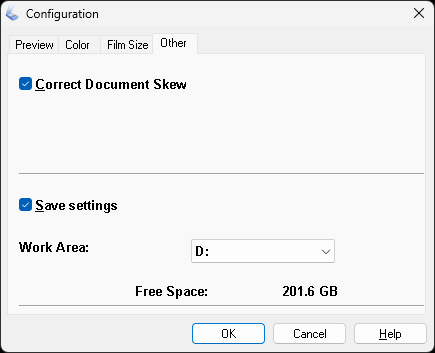

[Andrеy Lapрo — … Portfolio](https://korb.github.io/qa-portfolio) / […](https://korb.github.io/qa-portfolio#featured-work) / […)](https://korb.github.io/qa-portfolio#pdf-xchange-pro-deep-dive)

# Document Digitization Workflow  

> **Note:** This is an anonymized translation of internal documentation created for Russian-speaking colleagues at an e-commerce company. Interface elements and software names appear in Russian as they were used in the original workflow. The company managed 50,000+ products with extensive paper-based documentation that needed digitization.  

**Document Type:** Process Documentation  
**Audience:** content managers, operations team  
**Original Language:** Russian  

---  

A lot of product documentation still arrives as paper only. The printed material is often good enough quality to use on the website, and the information itself is valuable for reference. The goal here is to convert these paper documents into proper digital files—searchable text, copy-paste functionality, the works.  

Before you start scanning anything, make sure you have one of these:  
- A second copy of the document  
- Page numbers printed on every page  
- A video recording of yourself flipping through the entire thing  

This matters because pages get mixed up during batch scanning. You'll need something to verify the correct order afterward.  

---  

## Document Formats  

Documents come in three physical formats, each requiring different preparation.  

**Loose sheets** are the easiest. Same size, ready to scan. Nothing to prepare.  

**Folded and stapled sheets** are trickier. If you just remove the staples and unfold everything, the inner pages will be smaller than the outer ones. Two options: either align everything by the outer edge and trim to the smallest page, or cut off the stapled portion entirely. We don't have a guillotine cutter, press, or clamps, so you'll be using a cutting mat, metal ruler, and utility knife. The edge won't be perfectly even, and you'll get paper dust in the scanner. Can't be helped.  

**Perfect-bound documents** (glued spine, like paperback books) need the spine cut off. Ideally on a proper cutter so the cut is straight and perpendicular. Manual cutting works but produces worse results.  

There's a print shop on the first floor of our building. I had them cut the spines off about 15 catalogs in half an hour for cash, no receipt. Worth considering if you have a lot to process.  

---  

## Scanning  

Glossy or thick pages might jam the auto-feed scanner. Use a flatbed scanner for those.  

For auto-feed scanning, use Samsung Printer Experience or whatever scanner software you have. The specific model doesn't matter as much as getting the settings right.  

**Basic settings:**  
- **Scan profile**: Image Scan  
- **Image type**: Full color  
- **Paper size**: Auto-detect or choose manually  
- **Source**: Auto-feeder, both sides, long edge  
- **Resolution**: 300 DPI[^1]  

[^1]: For high-quality print materials on glossy paper, try 350 DPI and compare the results at high magnification. Choose whichever looks better for that specific document.  

**Important:** Most scanner software offers **Документ** (**Document**) or **Фото** (**Photo**) modes. Document mode aggressively brightens the background and washes out light elements in photos. This destroys image quality. Use **Photo** mode unless you're scanning text-only pages. If you mix modes in a multi-page document, the difference will be obvious when flipping through pages.  

I've noticed that with **Автоподатчик: две стороны** (duplex auto-feed), the reverse side gets saved rotated 180°. Check your first scan and adjust if needed.  

You can also use ABBYY FineReader OCR-редактор (**Файл** > **Сканировать страницы**) or the **Acquire images from scanner** tool in FastStone Image Viewer. FineReader won't save images separately unless you save the OCR project.  

For flatbed scanning with Epson Scan: Enhanced with Epson Easy Photo Fix 3.9.2.1RU, the settings that work are:  

Click to see screenshot
  

  

  
͏  
**Mode** (**Режим**): Professional Mode (Профессиональный режим)  
**Original** (**Оригинал**):  
- **Document Type** (**Тип документа**): Reflective (Непрозрачный)  
- **Document Source** (**Источник документа**): Document Table (Планшет для документов)  
- **Auto Exposure Type** (**Тип автоэкспозиции**): Photo (Фото)  

**Destination** (**Назначение**):  
- **Image Type** (**Тип изображения**): 24-bit Color (Цветной 24 бита)  
- **Resolution** (**Разрешение**): 300 dpi  
- **Document Size** (**Размер документа**): *(pick the smallest size that doesn't crop content on any page)*  
- **Target Size** (**Размер назначения**): Original (Оригинал)  

**Adjustments** (**Настройки**):  
- **Auto exposure** (**Автоэкспозиция**): On (Включено)  
- **Unsharp Mask** > **Level** (**Повышение резкости** > **Уровень**): On > Low (Включено > Низкий)  
- **Descreening** > **Screen Ruling** (**Удаление растра** / **Линиатура**): Fine Prints (175 lpi) (Качественная печать (175 lpi))  
- **Color Restoration** (**Восстановление цвета**): Off (Выключено)  
- **Backlight Correction** (**Коррекция фона**): Off (Выключено)  
- **Dust Removal** > **Level** (**Удаление дефектов** > **Уровень**): On > Low (Включено > Низкий)  
- **Digital Ice Technology**: Off (Выключено)  

In **Конфигурация** (**Configuration**) > **Другое** (**Other**) you can enable **Коррекция перекоса документа** (**Correct Document Skew**). If you do, check afterward that the automatic deskew worked correctly on all pages. Fix any mistakes manually in FastStone Image Viewer or re-scan the bad pages.  

Click to see screenshot
  

  

  
͏  
Save as TIFF when available (it preserves pixel density information), or PNG if TIFF isn't an option.  

Click to see screenshot
  

  

  

---  

## Post-Processing  

After scanning, sort the files by name and verify the page order is correct. This is where that backup copy, page numbers, or video recording comes in.  

FastStone Image Viewer lets you reorder images arbitrarily and then rename them sequentially. Here's how:  

1. Open the folder with scans in File Explorer  
2. Right-click the folder > **Browse with FastStone** (if context menu integration is installed)  
   - If that option doesn't exist: Right-click any scan > **Open with** > **FastStone Image Viewer**  
   - If that's not there either: Right-click any scan > **Open with** > **Choose another app** > **Choose an app on your PC** > navigate to FastStone Image Viewer folder > select **FSViewer.exe** > **OK**  
3. Press <kbd>Enter</kbd>  
4. You'll see all images in the folder in some order. In the dropdown list **Thumbnail Order** choose **Date Taken** (sorts by creation date)  
5. Go through the images from first to last, checking the order is right. If pages are out of sequence, drag and drop to fix them  
6. When you're done reordering, select all images and press <kbd>F2</kbd>  
7. In the **Batch Rename** tab of the **Batch Image Convert / Rename** window, set Template to **###** and **Sequential number starts from** to **1**  
8. Click **Rename**  

Click to see screenshot

͏  
Files will be renamed sequentially starting from **001** according to the current display order.  

To compress TIFF files (saves storage space without losing quality), use FastStone Image Viewer:  

- Select the files  
- Press <kbd>F3</kbd> (opens the **Batch Convert** tab)  
- **Output Folder**: uncheck to overwrite the originals  
- **Output Format**: TIFF Format (*.tif)  
- **Settings** > **Compression**: ZIP  
- Make sure **Use Advanced Options (Resize…)** is unchecked  
- Click **Convert**  

Click to see screenshot

͏  
After digitization is complete, follow [the OCR workflow](./ocr-workflow.md) to add the searchable text layer.  

---  

**Common mistakes to avoid:**  
- Skipping the verification step. Once pages are misordered, they're permanently misordered.  
- Using JPEG output. It reduces OCR accuracy.  
- Using Document mode for materials with photos. It destroys image quality.  
- Not checking duplex rotation on the first scan. All reverse pages will be upside down. This will reduce the quality of text recognition (there are reasons why we don't use automatic page orientation checking). It will also increase the likelihood that we'll end up with a low-quality document on our website or that such a document will be sent to a client. Both options will negatively impact our company's reputation.  

---  

*This workflow was developed for processing product documentation items. It's been tested on catalogs, technical specifications, brochures, and mixed-format documents.*

